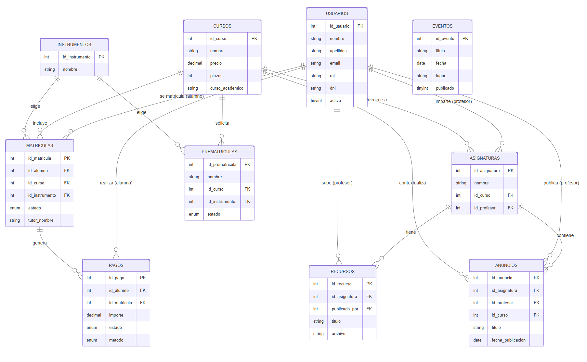

## 2. Arquitectura General del Sistema

La aplicación sigue una arquitectura en capas clásica de aplicación web PHP. Cada solicitud HTTP es procesada por un script PHP que gestiona la lógica de negocio, consulta la base de datos mediante MySQLi y delega la presentación en plantillas HTML reutilizables. No se utiliza ningún framework.

## Índice del capítulo

- [2.1 Tecnologías utilizadas](#21-tecnologías-utilizadas)
- [2.2 Estructura de módulos](#22-estructura-de-módulos)
- [2.3 Roles del sistema](#23-roles-del-sistema)
- [2.4 Modelo de datos](#24-modelo-de-datos-entidades-principales)
  - [Cardinalidades](#cardinalidades)
  - [Diagrama entidad-relación](#diagrama-entidad-relación)
- [2.5 Funciones reutilizables y seguridad](#25-funciones-reutilizables-y-seguridad)
- [2.6 Autenticación y gestión de sesiones](#26-autenticación-y-gestión-de-sesiones)
- [2.7 Control de acceso por rol](#27-control-de-acceso-por-rol)
- [2.8 Validación de datos](#28-validación-de-datos)

### 2.1 Tecnologías utilizadas

| Capa | Tecnología / Versión |
|---|---|
| Servidor web | Apache 2.4 (XAMPP / AWS) |
| Backend | PHP 8.0 |
| Base de datos | MariaDB 10.4 |
| Acceso a datos | SQL mediante mysqli |
| Administración BD | phpMyAdmin |
| Frontend | HTML5, CSS3, JavaScript |
| Librería JS | jQuery 3.7.1 + jQuery UI 1.13.2 |
| Calendario | FullCalendar 6.1.11 |
| Galería / Slideshow | Fancyapps (Fancybox) |
| Generación PDF | FPDF (incluida en `/pdf/`) |
| Control de versiones | Git + GitHub (ramas `main` / `develop`) |
| Despliegue | AWS EC2 |
| Documentación | Markdown + GitHub Pages |

---

### 2.2 Estructura de módulos

| Módulo / Carpeta | Responsabilidad |
|---|---|
| `/` (raíz) | Zona pública: index, login, matrícula, eventos, páginas informativas |
| `/admin/` | Panel exclusivo del administrador: CRUD completo de entidades |
| `/profesor/` | Panel del profesorado: asignaturas, alumnos, anuncios y recursos |
| `/alumno/` | Panel del alumnado: asignaturas, anuncios y recursos |
| `/includes/` | Funciones reutilizables: autenticación, validación, paginación |
| `/plantillas/` | Cabeceras, navbars y pies de página reutilizables (públicos y privados) |
| `/ajax/` | Endpoints JSON para peticiones asíncronas (asignaturas, eventos) |
| `/subidas/` | Archivos subidos por usuarios: carteles de eventos y recursos didácticos |
| `/pdf/` | Librería FPDF y plantilla base para generación de PDFs institucionales |
| `/estaticos/` | CSS, JavaScript global y recursos de imagen |

### 2.3 Roles del sistema

El sistema contempla cuatro actores: el visitante (sin autenticación), y tres perfiles con acceso a zona privada: administrador, profesor y alumno. Cada rol tiene su propio panel de inicio y sus rutas están protegidas mediante verificación de sesión y comprobación de rol en cada script PHP.

| Rol | Descripción general |
|---|---|
| **Visitante** | Accede a la parte pública: inicio, eventos, escuela, banda, contacto y formulario de prematrícula. |
| **Administrador** | Gestión integral del sistema: usuarios, cursos, asignaturas, prematrículas, matrículas, pagos, anuncios y eventos. |
| **Profesor** | Visualización de sus asignaturas, listado de alumnos (con exportación PDF), gestión de anuncios y recursos didácticos. |
| **Alumno** | Consulta de sus asignaturas activas, anuncios y recursos asociados a esas asignaturas. |

### 2.4 Modelo de datos: entidades principales

La base de datos `escuela_filarmonica` está compuesta por diez tablas cuyas relaciones articulan todos los procesos de negocio del sistema.

| Tabla | Clave primaria | Descripción y relaciones principales |
|---|---|---|
| `usuarios` | `id_usuario` | Entidad principal del sistema que almacena los perfiles de administración, profesorado y alumnado. |
| `cursos` | `id_curso` | Define las enseñanzas ofertadas con precio y número de plazas disponibles. Referenciado por asignaturas, prematrículas y matrículas. |
| `asignaturas` | `id_asignatura` | Pertenecen a un curso y pueden tener un profesor asignado. Son el nexo entre el profesor y el alumnado. |
| `instrumentos` | `id_instrumento` | Catálogo de instrumentos seleccionables en prematrículas y matrículas. |
| `prematriculas` | `id_prematricula` | Solicitudes recibidas de visitantes. Estado: `pendiente` / `aprobada` / `rechazada`. |
| `matriculas` | `id_matricula` | Matrículas formalizadas. Vincula alumno, curso e instrumento. Estado: `activa` / `finalizada` / `cancelada`. |
| `pagos` | `id_pago` | Registros económicos vinculados a una matrícula. Estado: `pendiente` / `pagado` / `vencido`. |
| `anuncios` | `id_anuncio` | Comunicados publicados por un profesor en una asignatura concreta. |
| `recursos` | `id_recurso` | Materiales didácticos (archivos o enlaces) vinculados a una asignatura. |
| `eventos` | `id_evento` | Actividades públicas de la escuela con cartel, fecha, hora y lugar. |

Las relaciones entre estas entidades permiten automatizar los procesos académicos y administrativos de la aplicación, desde la solicitud inicial de prematrícula hasta la gestión de asignaturas, recursos, anuncios y pagos.

## Cardinalidades

| Relación | Tipo | Descripción |
|---|---|---|
| `cursos` → `asignaturas` | 1:N | Un curso tiene varias asignaturas |
| `usuarios` → `asignaturas` | 1:N | Un profesor imparte varias asignaturas |
| `usuarios` → `matriculas` | 1:N | Un alumno puede tener varias matrículas |
| `cursos` → `matriculas` | 1:N | Un curso tiene varios alumnos matriculados |
| `instrumentos` → `matriculas` | 1:N | Un instrumento se elige en varias matrículas |
| `matriculas` → `pagos` | 1:N | Una matrícula genera varios pagos |
| `usuarios` → `pagos` | 1:N | Un alumno tiene varios pagos asociados |
| `cursos` → `prematriculas` | 1:N | Un curso recibe varias solicitudes previas |
| `instrumentos` → `prematriculas` | 1:N | Un instrumento puede solicitarse en varias prematriculas |
| `asignaturas` → `anuncios` | 1:N | Una asignatura tiene varios anuncios |
| `cursos` → `anuncios` | 1:N | Un curso contextualiza varios anuncios |
| `usuarios` → `anuncios` | 1:N | Un profesor publica varios anuncios |
| `asignaturas` → `recursos` | 1:N | Una asignatura tiene varios recursos didácticos |
| `usuarios` → `recursos` | 1:N | Un profesor sube varios recursos |
| `eventos` | independiente | Sin FK; entidad autónoma |

## Diagrama entidad-relación

### 2.5 Funciones reutilizables y seguridad

Con el objetivo de evitar duplicidad de código y facilitar el mantenimiento de la aplicación, se han centralizado diversas operaciones comunes en los archivos `includes/config.php` e `includes/funciones.php`.

Estas funciones son utilizadas por múltiples módulos del sistema, especialmente en tareas relacionadas con autenticación, control de acceso, validación de datos, conexión a la base de datos y paginación de resultados.

| Función | Descripción |
|----------|----------|
| `conectar()` | Establece la conexión con la base de datos MariaDB mediante mysqli. |
| `desconectar()` | Cierra la conexión con la base de datos. |
| `comprobarAcceso()` | Verifica que exista una sesión activa antes de acceder a una página privada. |
| `comprobarRol()` | Comprueba que el usuario posee el rol requerido para acceder a un módulo. |
| `redirigirSegunRol()` | Redirige al usuario a su panel correspondiente según su rol. |
| `validarDNI()` | Valida el formato de documentos DNI y NIE. |
| `validarEmail()` | Comprueba el formato correcto de una dirección de correo electrónico. |
| `validarTelefono()` | Valida números de teléfono nacionales. |
| `paginar()` | Calcula límites y desplazamientos para la paginación de listados. |
| `mostrarPaginacion()` | Genera la navegación entre páginas de resultados. |
| `botonVolver()` | Muestra un enlace de retorno reutilizable en los formularios. |

### 2.6 Autenticación y gestión de sesiones

El sistema utiliza sesiones PHP nativas iniciadas en `includes/config.php` mediante `session_start()`. Al autenticarse, se almacenan en sesión el identificador del usuario, su nombre, email y rol. La sesión persiste hasta que el usuario cierra el navegador o hace logout explícito. El archivo `logout.php` destruye completamente la sesión con `session_destroy()` y redirige al login.

Las contraseñas se almacenan exclusivamente como hashes bcrypt generados con `password_hash()`. La verificación se realiza con `password_verify()`, resistente a ataques de tiempo.

### 2.7 Control de acceso por rol

Cada página de la zona privada invoca en sus primeras líneas las funciones `comprobarAcceso()` (verifica que existe sesión activa) y `comprobarRol()` (verifica que el rol en sesión coincide con el requerido). Si alguna comprobación falla, el sistema redirige automáticamente al panel del rol correspondiente o al login, sin revelar información sobre la existencia de la ruta solicitada. Este patrón se aplica de forma sistemática en los tres módulos privados.

### 2.8 Validación de datos

La aplicación implementa una estrategia de validación en varias capas con el objetivo de mejorar la experiencia de usuario y garantizar la integridad de la información procesada.

En primer lugar, los formularios utilizan las capacidades nativas de validación de HTML5 mediante atributos como `required`, tipos específicos de entrada (`email`, `date`, etc.) y restricciones básicas de formato. Estas comprobaciones permiten detectar errores antes de enviar los datos al servidor.

Adicionalmente, se emplea JavaScript para realizar validaciones en cliente y proporcionar retroalimentación inmediata al usuario. Para ello se utilizan eventos como `change` y `submit`, junto con expresiones regulares y manipulación dinámica del DOM.

Finalmente, en aquellos procesos críticos relacionados con la gestión académica y administrativa, se realizan validaciones adicionales en el servidor mediante funciones PHP reutilizables, garantizando que los datos recibidos sean válidos independientemente de las comprobaciones realizadas en el navegador.

| Capa de validación | Finalidad                                                    |
| ------------------ | ------------------------------------------------------------ |
| HTML5              | Comprobación de campos obligatorios y formatos básicos.      |
| JavaScript         | Validación en cliente e interacción dinámica de formularios. |
| PHP                | Validación de datos críticos y lógica de negocio.            |
| Base de datos      | Garantía de integridad mediante claves primarias y foráneas. |

| Tipo de validación | Descripción |
|---|---|
| Campos obligatorios | `isset()` + `trim()` en PHP; `required` + comprobación en `submit` en JS. |
| Formato email | `FILTER_VALIDATE_EMAIL` en PHP; regex en JS. |
| Formato teléfono | `/^[0-9]{9}$/` en PHP y JS. |
| DNI/NIE español | Función `validarDNI()` con regex en PHP; regex en JS. |
| Duplicado DNI + Curso | Consulta antes del INSERT en `prematriculas`. |
| Archivos subidos | Validación de extensión por lista blanca y tamaño máximo en servidor, no solo en cliente. |

---