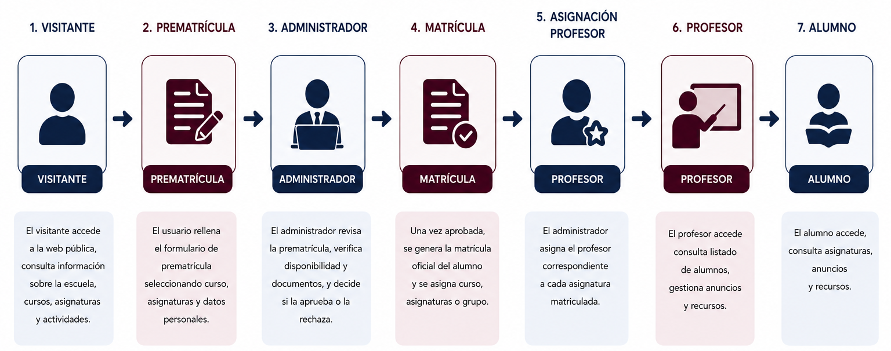
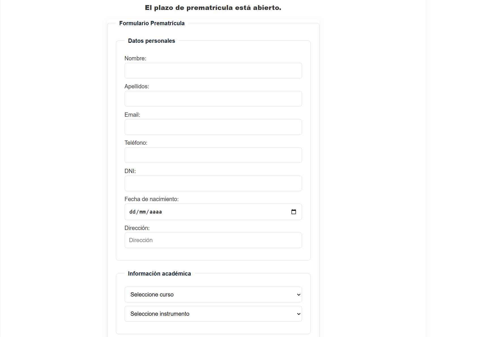
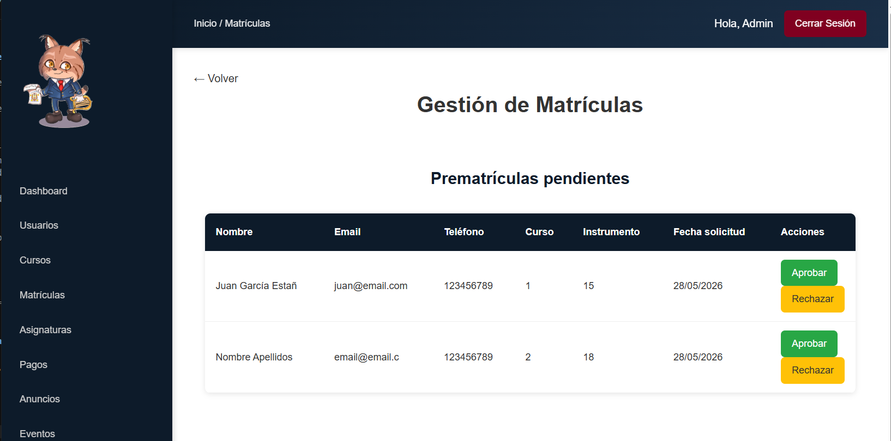
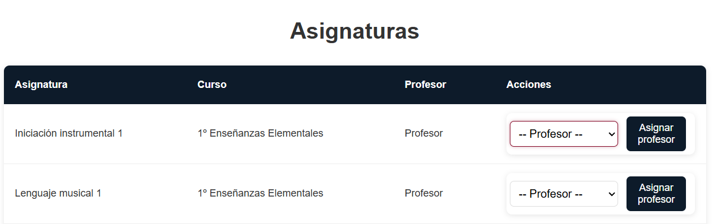
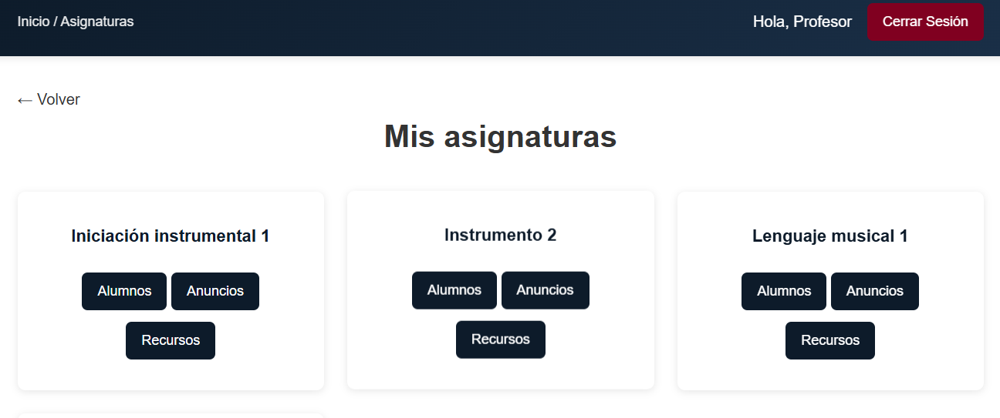
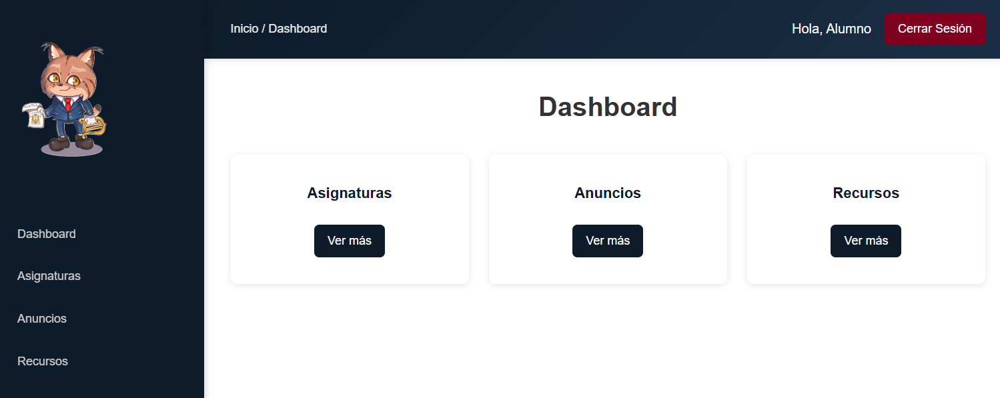

# Flujo principal de negocio: del visitante al alumno activo

El proceso central de la plataforma abarca desde que un visitante realiza una solicitud de prematrícula hasta que el alumno accede a su panel privado para consultar sus asignaturas, anuncios y recursos didácticos.

*Figura 1. Flujo principal de negocio de la aplicación.*

---

## 3.1 Solicitud de prematrícula

El visitante accede al formulario público sin necesidad de autenticarse. Selecciona el curso e instrumento deseados e introduce sus datos personales. Si el solicitante es menor de edad, el sistema solicita también los datos del tutor legal.

Una vez enviada la solicitud y superadas las validaciones correspondientes, se registra una nueva prematrícula con estado pendiente de revisión.

**Tablas implicadas:** `prematriculas`, `cursos`, `instrumentos`, `asignaturas`.

---

## 3.2 Revisión y aprobación de la prematrícula

El administrador revisa las solicitudes pendientes y puede corregir o completar la información antes de formalizar la matrícula.

La aprobación desencadena automáticamente varias operaciones del sistema:

| Automatización          | Resultado                                 |
| ----------------------- | ----------------------------------------- |
| Creación de usuario     | Generación de cuenta con rol de alumno    |
| Generación de matrícula | Registro de matrícula activa              |
| Actualización de plazas | Reducción de plazas disponibles del curso |
| Generación de pago      | Creación del pago pendiente asociado      |
| Cierre de prematrícula  | Cambio de estado a aprobada               |

Este proceso constituye la operación principal de la aplicación, ya que transforma una solicitud inicial en un alumno plenamente integrado en el sistema.

**Tablas implicadas:** `prematriculas`, `usuarios`, `matriculas`, `cursos`, `pagos`.

---

## 3.3 Caso alternativo: rechazo de la solicitud

Si la solicitud no puede ser aceptada, el administrador puede rechazarla. En este caso únicamente se actualiza el estado de la prematrícula, sin generar usuarios, matrículas ni pagos asociados.

---

## 3.4 Asignación de profesorado

El administrador asigna un profesor a cada asignatura. Esta relación determina qué alumnado puede visualizar el profesor y sobre qué asignaturas puede gestionar anuncios y recursos.

**Tablas implicadas:** `asignaturas`, `usuarios`.

---

## 3.5 Gestión académica del profesorado

El profesorado accede a las asignaturas que tiene asignadas y puede consultar el listado de alumnos matriculados. Además, dispone de herramientas para publicar anuncios, compartir recursos didácticos y exportar listados a PDF.

**Tablas implicadas:** `asignaturas`, `matriculas`, `usuarios`, `instrumentos`, `cursos`.

---

## 3.6 Acceso del alumnado

Una vez matriculado, el alumno puede acceder a su área privada mediante sus credenciales.

Desde ella dispone de acceso a:

* **Mis asignaturas:** asignaturas asociadas a su matrícula activa.
* **Anuncios:** comunicaciones publicadas por el profesorado.
* **Recursos:** materiales didácticos disponibles para sus asignaturas.

Toda la información mostrada se encuentra filtrada según la matrícula activa del alumno.

**Tablas implicadas:** `usuarios`, `matriculas`, `cursos`, `asignaturas`, `anuncios`, `recursos`.

