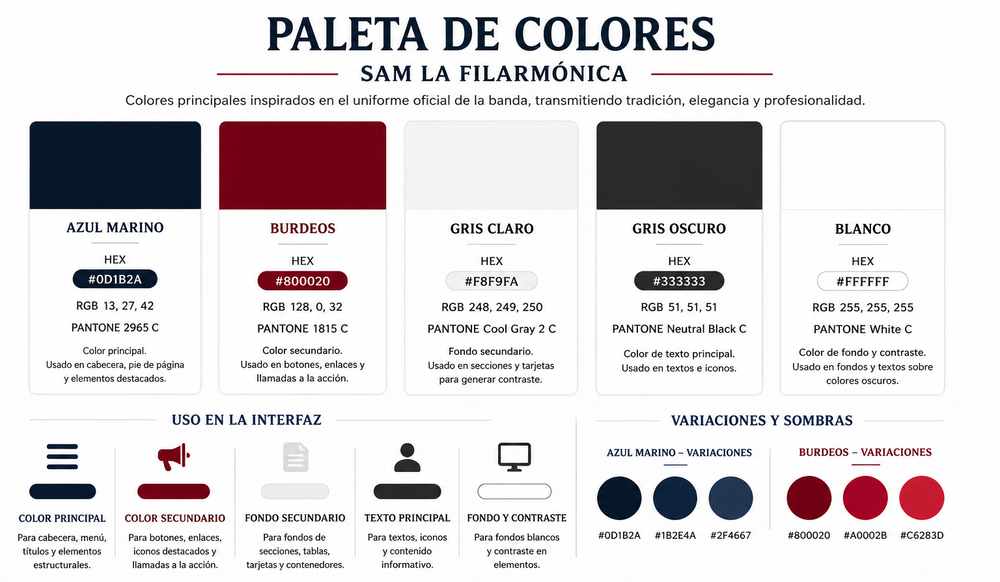
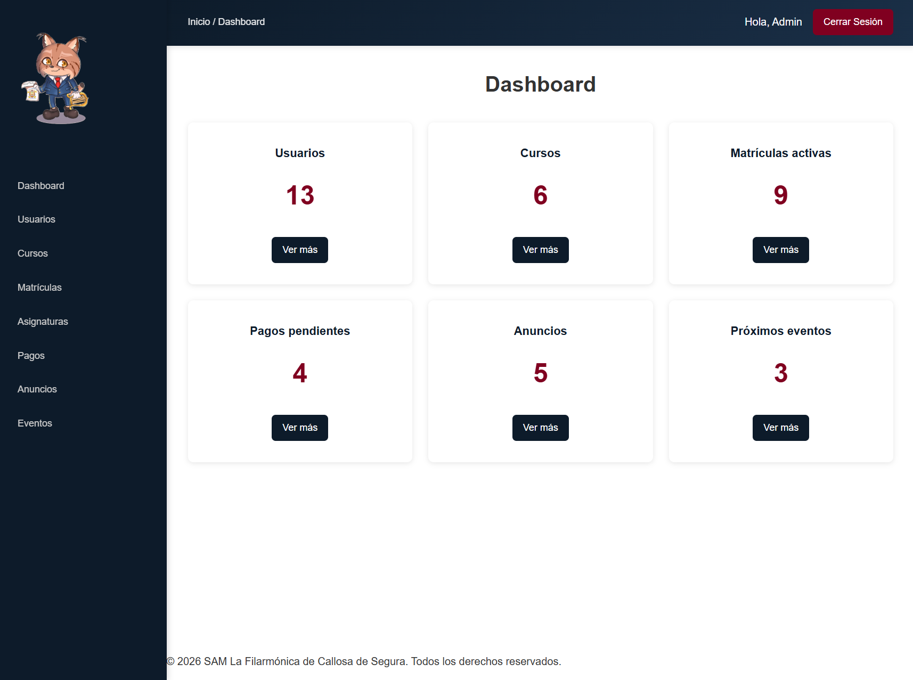
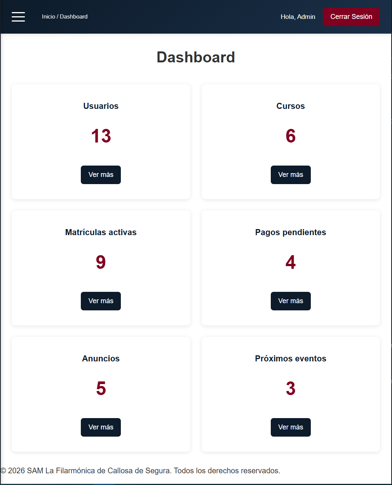
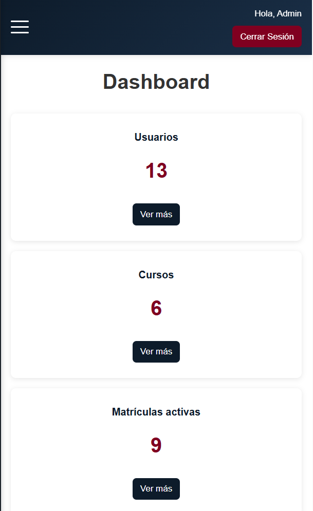
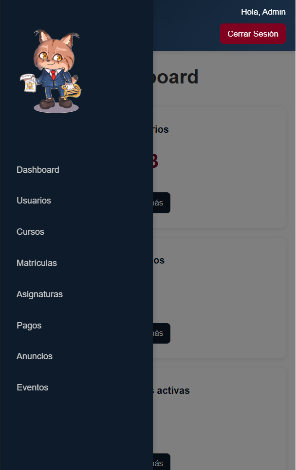
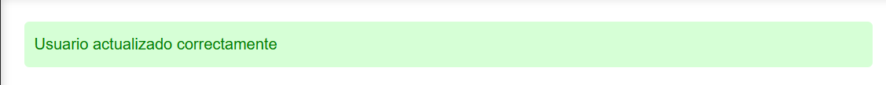
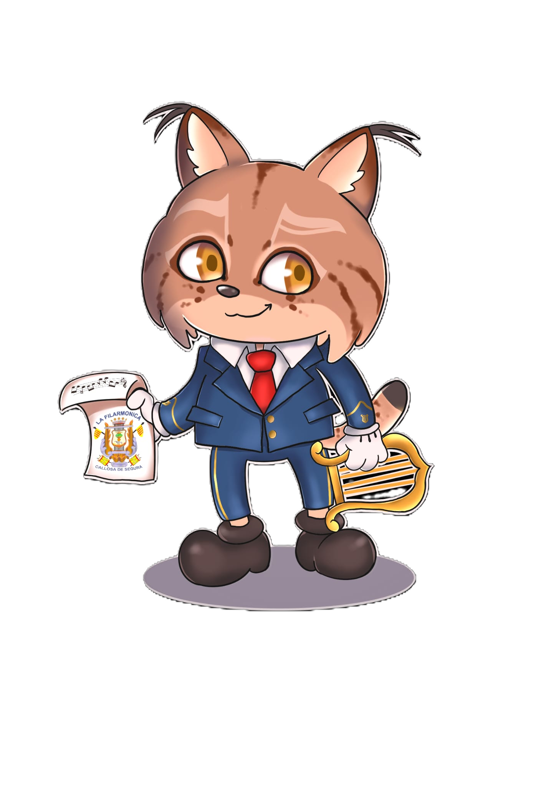

# Guía de Estilo

## Índice
* [Introducción](#introducción)
* [Estructura visual](#estructura-visual)
* [Paleta de colores](#paleta-de-colores)
* [Tipografía](#tipografía)
* [Navegación y componentes](#navegación-y-componentes)
  * [Menú responsive](#menú-responsive)
  * [Tablas](#tablas)
  * [Formularios](#formularios)
  * [Tarjetas](#tarjetas)
  * [Mensajes de retroalimentación](#mensajes-de-retroalimentación)
* [Imágenes y recursos gráficos](#imágenes-y-recursos-gráficos)
  * [Mascota institucional](#mascota-institucional)
* [Diseño responsivo](#diseño-responsivo)
  * [Puntos de ruptura](#puntos-de-ruptura)
  * [Adaptaciones principales](#adaptaciones-principales)


## Introducción

La interfaz de la aplicación ha sido diseñada siguiendo criterios de claridad, simplicidad y coherencia visual. El objetivo principal es ofrecer una experiencia de usuario intuitiva tanto para visitantes como para alumnos, profesores y administradores.
El diseño se ha desarrollado siguiendo la metodología **Mobile First**, adaptándose posteriormente a tablet y escritorio mediante técnicas de diseño responsivo.

---

## Estructura visual

La aplicación mantiene una estructura homogénea en todas sus páginas:

* Cabecera con logotipo y menú de navegación.
* Área principal de contenido.
* Formularios y tablas adaptados al dispositivo.
* Pie de página común.

Se han utilizado elementos semánticos de HTML5 (`header`, `main`, `section`, `article`, `footer`) para mejorar la organización y accesibilidad del contenido.

La maquetación de la aplicación combina principalmente las tecnologías CSS Flexbox y CSS Grid.
**Flexbox** se utiliza para la distribución de elementos en una única dirección, especialmente en componentes como la barra de navegación, los formularios, los botones de acción y determinados bloques de contenido.
**CSS Grid** se emplea para organizar estructuras más complejas, como la distribución de tarjetas, paneles de administración y algunas secciones de contenido que requieren varias columnas.

La combinación de ambas técnicas permite construir una interfaz flexible, adaptable a distintos tamaños de pantalla y fácil de mantener.

---

## Paleta de colores

La identidad visual toma como referencia los colores institucionales de la Sociedad Musical La Filarmónica.

| Color       | Código    | Uso                                             |
| ----------- | --------- | ----------------------------------------------- |
| Azul marino | `#0D1B2A` | Cabecera, pie de página y elementos principales |
| Burdeos     | `#800020` | Botones y llamadas a la acción                  |
| Gris claro  | `#F8F9FA` | Fondos secundarios                              |
| Gris oscuro | `#333333` | Texto principal                                 |
| Blanco      | `#FFFFFF` | Fondos y contraste                              |



---

## Tipografía

Se utiliza la familia tipográfica:

```css
Helvetica Neue, Arial, sans-serif
```

La jerarquía visual se organiza mediante:

* `h1` para títulos principales.
* `h2` para secciones.
* `h3` para subsecciones y tarjetas.
* Texto base para contenido informativo.

---

## Navegación y componentes

### Menú responsive

La navegación se adapta automáticamente al tamaño de pantalla:

* Menú hamburguesa en móvil y tablet.
* Menú horizontal en escritorio.
* Misma estructura de enlaces en todos los dispositivos.

### Tablas

Los listados administrativos se adaptan al ancho disponible mediante CSS responsive y sistemas de paginación para evitar la sobrecarga visual.

### Formularios

Los formularios mantienen una apariencia uniforme mediante estilos comunes y validaciones implementadas en HTML5, JavaScript y PHP.

### Tarjetas

Se utilizan tarjetas para mostrar cursos, asignaturas y distintos elementos visuales de forma clara y organizada.








### Mensajes de retroalimentación

La aplicación utiliza mensajes visuales diferenciados para informar al usuario del resultado de sus acciones.

| Tipo | Colores utilizados |
|---|---|
| Éxito | Fondo verde claro y texto verde |
| Error | Fondo rojo claro y texto rojo oscuro |



Estos mensajes aparecen en operaciones como creación de matrículas, gestión de usuarios, subida de recursos o validación de formularios.

---

## Imágenes y recursos gráficos

Las imágenes se muestran manteniendo proporciones mediante técnicas de adaptación responsive.

La aplicación incorpora:

* Logotipo institucional.
* Carteles de eventos.
* Recursos multimedia.
* Slideshow en la página principal mediante Fancybox.


### Mascota institucional

En la zona privada de la aplicación se ha incorporado la figura de **Cecilio**, la mascota de la Escuela de Música La Filarmónica, como elemento visual identificativo.

Su presencia tiene como objetivo aportar cercanía y reforzar la identidad propia de la escuela dentro de los paneles de administración, profesorado y alumnado, diferenciando claramente la zona de gestión de la parte pública de la web.

La mascota se utiliza de forma decorativa y corporativa, manteniendo la coherencia visual con la imagen institucional de la entidad.



## Diseño responsivo

La aplicación ha sido desarrollada siguiendo el enfoque Mobile First.

### Puntos de ruptura

| Dispositivo | Ancho     |
| ----------- | --------- |
| Móvil       | < 768 px  |
| Tablet      | ≥ 768 px  |
| Escritorio  | ≥ 1024 px |

### Adaptaciones principales

* Menú hamburguesa en dispositivos pequeños.
* Reorganización automática de tarjetas y bloques de contenido.
* Tablas adaptadas al ancho disponible.
* Formularios optimizados para pantallas táctiles.
* Reestructuración del pie de página según el tamaño de pantalla.

El objetivo es garantizar una experiencia de uso consistente independientemente del dispositivo utilizado.
